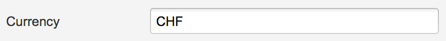
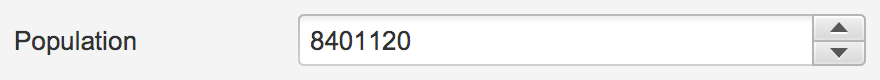
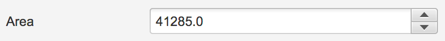
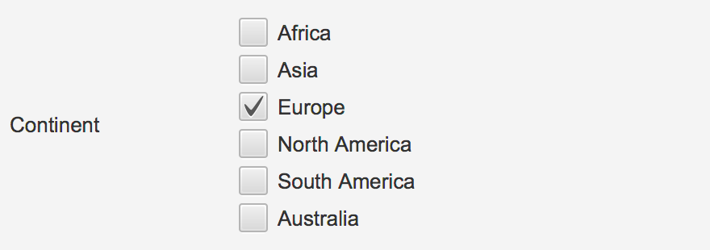
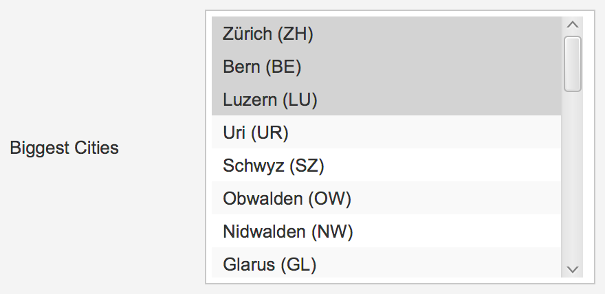

[  ](https://bintray.com/dlsc-oss/repository/FormsFX/_latestVersion)

# FormsFX
**Forms for business application made easy. Creating forms in Java has never been this easy!**

[  ](https://bintray.com/dlsc-oss/repository/FormsFX/_latestVersion)

## Maven

To use this framework as part of your Maven build simply add the jcentral repository to your pom.xml file and use the following dependency definition.

```XML
<repositories>
  <repository>
    <id>jcenter</id>
    <url>http://jcenter.bintray.com</url>
  </repository>
</repositories>

<dependency>
  <groupId>com.dlsc.formsfx</groupId>
  <artifactId>formsfx-core</artifactId>
  <version>1.2</version>
</dependency>
```

## What is FormsFX?

Creating forms in JavaFX is a tedious and very error-prone task. FormsFX is a framework which solves this problem. It enables the developer to create forms with ease and creates well-designed and user-friendly forms by default. FormsFX offers a fluent API that is very easy to understand and reduces the amount of coding needed. It creates all the necessary bindings for the properties and *it just works*.

## Main Features

- Simple and understandable Fluent API
- Different semantic items
- Pre-defined controls
- Validation
- Localisation

```Java
Form loginForm = Form.of(
        Group.of(
                Field.ofStringType(model.usernameProperty())
                        .label("Username"),
                Field.ofStringType(model.passwordProperty())
                        .label("Password")
                        .required("This field can’t be empty")
        )
).title("Login");
```

## Semantics

FormsFX offers different semantic layers. The largest entity is the form. It contains groups and sections, which in turn act as containers for fields. Fields are the end user's primary point of interaction as they handle data input and presentation.

## Defining a form

Creating a form is as simple as calling `Form.of()`.

```Java
Form.of(
        Group.of(
                Field.ofStringType("")
                        .label("Username"),
                Field.ofStringType("")
                        .label("Password")
                        .required("This field can’t be empty")
        ),
        Group.of(…)
).title("Login");
```

Fields have a range of options that define their semantics and change their functionality.

Option | Description
------ | -----------
`label(String)` | Describes the field’s content in a concise manner. This description is always visible and usually placed next to the editable control.
`tooltip(String)` | This contextual hint further describes the field. It is usually displayed on hover or focus.
`placeholder(String)` | This hint describes the expected input as long as the field is empty.
`required(boolean)` <br /> `required(String)` | Determines, whether entry in this field is required for the correctness of the form.
`editable(boolean)` | Determines, whether end users can edit the contents of this field.
`id(String)` | Describes the field with a unique ID. This is not visible directly, but can be used for styling purposes.
`styleClass(List&lt;String&gt;)` | Adds styling hooks to the field. This can be used on the view layer.
`span(int)` <br /> `span(ColSpan)` | Determines, how many columns the field should span on the view layer. Can be a number between 1 and 12 or a ColSpan fraction.
`render(SimpleControl)` | Determines the control that is used to render this field on the view layer.


The following table shows how to create different fields and how they look by default:

String Control

<table>
  <tbody>
    <tr>
      <td colspan="2">String Control</td>
    </tr>
    <tr>
      <td></td>
    </tr>
    <tr>
      <td>
        <pre lang="java">Field.ofStringType("CHF")
     .label("Currency")</pre>
      </td>
    </tr>
  </tbody>
</table>
<table>
  <tbody>
    <tr>
      <td colspan="2">Integer Control</td>
    </tr>
    <tr>
      <td></td>
    </tr>
    <tr>
      <td>
        <pre lang="java">Field.ofIntegerType(8401120)
     .label("Population")</pre>
      </td>
    </tr>
  </tbody>
</table>
<table>
  <tbody>
    <tr>
      <td colspan="2">Double Control</td>
    </tr>
    <tr>
      <td></td>
    </tr>
    <tr>
      <td>
        <pre lang="java">Field.ofDoubleType(41285.0)
       .label("Area")</pre>
      </td>
    </tr>
  </tbody>
</table>
<table>
  <tbody>
    <tr>
      <td colspan="2">Boolean Control</td>
    </tr>
    <tr>
      <td></td>
    </tr>
    <tr>
      <td>
        <pre lang="java">Field.ofBooleanType(false)
     .label("Independent")</pre>
      </td>
    </tr>
  </tbody>
</table>
<table>
  <tbody>
    <tr>
      <td colspan="2">ComboBox Control</td>
    </tr>
    <tr>
      <td></td>
    </tr>
    <tr>
      <td>
        <pre lang="java">Field.ofSingleSelectionType(Arrays.asList("Zürich (ZH)", "Bern (BE)", …), 1)
     .label("Capital")</pre>
      </td>
    </tr>
  </tbody>
</table>
<table>
  <tbody>
    <tr>
      <td colspan="2">RadioButton Control</td>
    </tr>
    <tr>
      <td></td>
    </tr>
    <tr>
      <td>
        <pre lang="java">Field.ofSingleSelectionType(Arrays.asList("Right", "Left"), 0)
     .label("Driving on the")
     .render(new SimpleRadioButtonControl<>())</pre>
      </td>
    </tr>
  </tbody>
</table>
<table>
  <tbody>
    <tr>
      <td colspan="2">CheckBox Control</td>
    </tr>
    <tr>
      <td></td>
    </tr>
    <tr>
      <td>
        <pre lang="java">Field.ofMultiSelectionType(Arrays.asList("Africa", "Asia", …), Collections.singletonList(2))
     .label("Continent")
     .render(new SimpleCheckBoxControl<>())</pre>
      </td>
    </tr>
  </tbody>
</table>
<table>
  <tbody>
    <tr>
      <td colspan="2">ListView Control</td>
    </tr>
    <tr>
      <td></td>
    </tr>
    <tr>
      <td>
        <pre lang="java">Field.ofMultiSelectionType(Arrays.asList("Zürich (ZH)", "Bern (BE)", …), Arrays.asList(0, 1, …))
     .label("Biggest Cities")</pre>
      </td>
    </tr>
  </tbody>
</table>

## Rendering a form

The only point of interaction is the `FormRenderer`. It delegates rendering of further components to other renderers.

```java
Pane root = new Pane();
root.getChildren().add(new FormRenderer(form));
```

All fields have a default control that is used for rendering. This can be changed to another compatible implementation using the `render()` method.

```java
Field.ofMultiSelectionType(…)
        .render(new SimpleCheckBoxControl<>())
```

## Model

Forms are used to create and manipulate data. In order to use this data in other parts of an application, model classes can be used. These classes contain properties, which are then bound to the persisted value of a field.

```java
StringProperty name = new SimpleStringProperty("Hans");
Field.ofStringType(name);
```

The `persist()` and `reset()` methods can be used to store and revert field values, which in turn updates the binding.

Fields in FormsFX store their values in multiple steps. For free-form fields, like `StringField` or `DoubleField`, the exact user input is stored, along with a type-transformed value and a persistent value. The persistence is, by default, handled manually, but this can be overridden by setting the `BindingMode` to `CONTINUOUS` on the form level.

## Localisation

All displayed values are localisable. Methods like `label()`, `placeholder()` accept keys which are then used for translation. By default, FormsFX includes a `ResourceBundle`-based implementation, however, this can be exchanged for a custom implementation.

```java
private ResourceBundle rbDE = ResourceBundle.getBundle("demo.demo-locale", new Locale("de", "CH"));
private ResourceBundle rbEN = ResourceBundle.getBundle("demo.demo-locale", new Locale("en", "UK"));

private ResourceBundleService rbs = new ResourceBundleService(rbEN);

Form.of(…)
        .i18n(rbs);
```

## Validation

All fields are validated whenever end users edit the contained data. FormsFX offers a wide range of pre-defined validators, but also includes support for custom validators using the `CustomValidator.forPredicate()` method.

| Validator | Description |
| --------- | ----------- |
| `CustomValidator` | Define a predicate that returns whether the field is valid or not. |
| `DoubleRangeValidator` | Define a number range which is considered valid. This range can be limited in either one direction or in both directions. |
| `IntegerRangeValidator` | Define a number range which is considered valid. This range can be limited in either one direction or in both directions. |
| `RegexValidator` | Valiate text against a regular expression. This validator offers pre-defined expressions for common use cases, such as email addresses.
| `SelectionLengthValidator` | Define a length interval which is considered valid. This range can be limited in either one direction or in both directions. |
| `StringLengthValidator` | Define a length interval which is considered valid. This range can be limited in either one direction or in both directions. |

## Advantages

- Less error-prone
- Less code needed
- Easy to learn
- Easy to understand
- Easy to extend

# Documentation

- [Javadocs](http://dlsc.com/wp-content/html/formsfx/apidocs/)
- [Report](./docs/Project%20Report.pdf)
